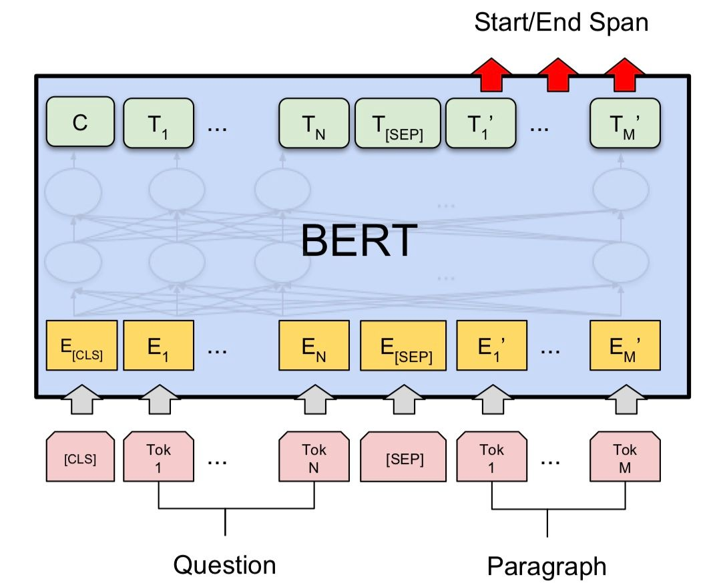
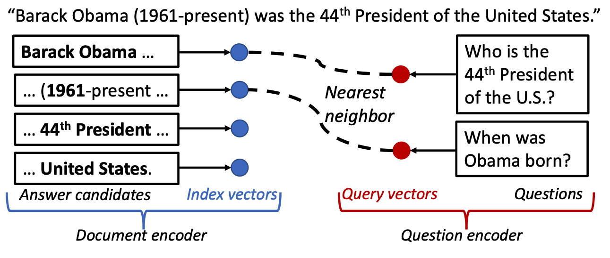
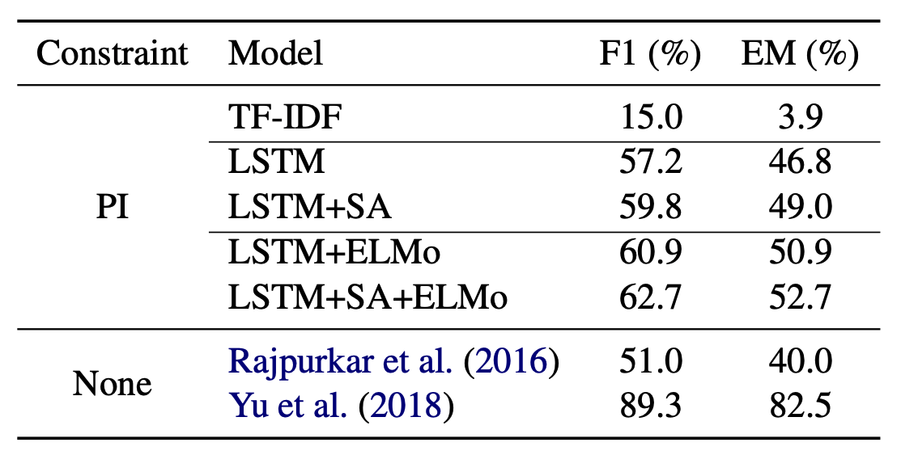
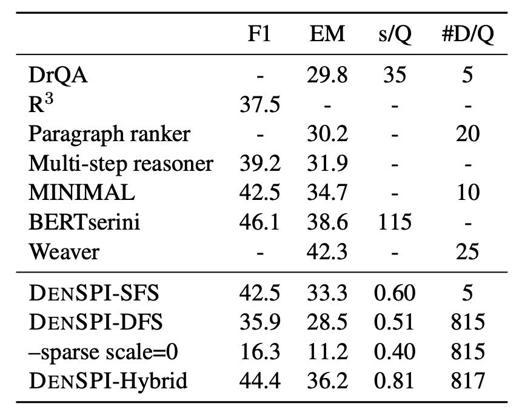
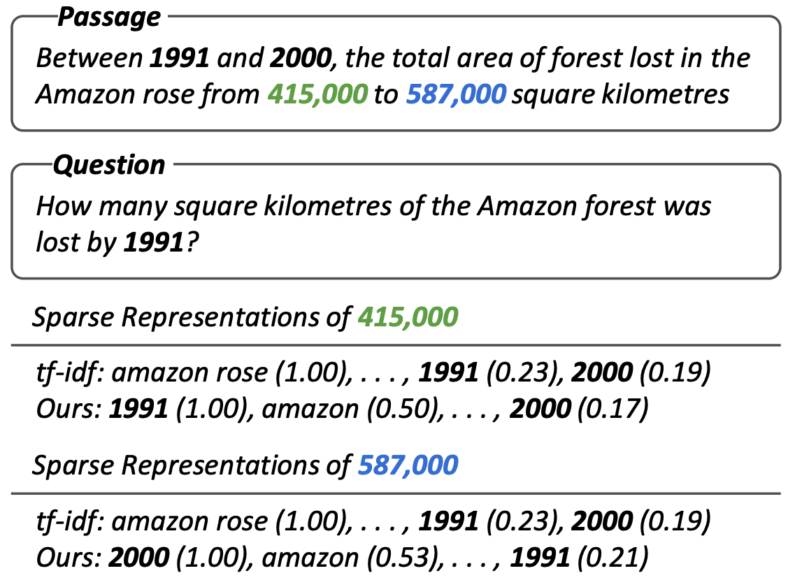
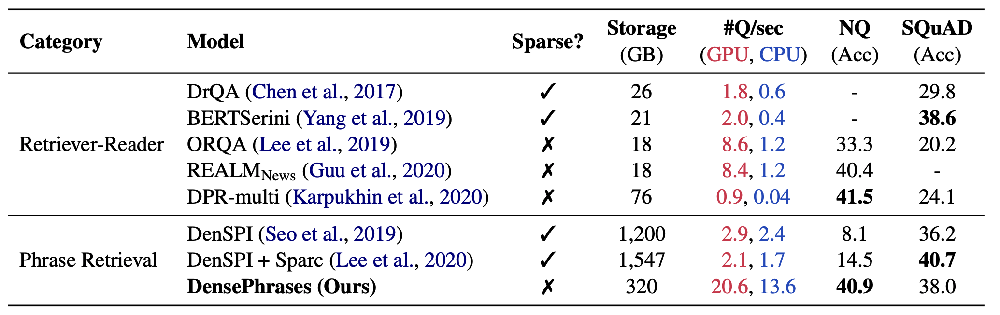
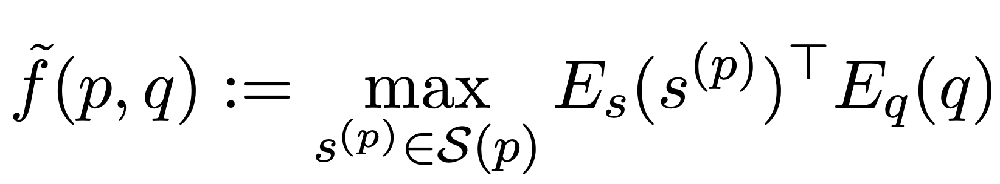
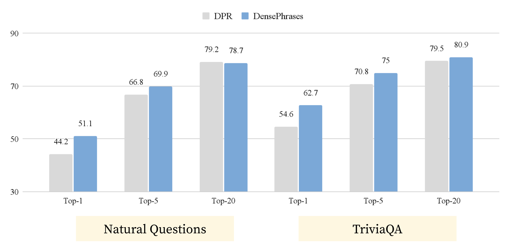

# Phrase Retrieval and Beyond
August 25, 2021, Written by [Jinhyuk Lee](https://jhyuklee.github.io)  
Reviewed and edited by Danqi Chen, Alexander Wettig, Zexuan Zhong, Vishvak Murahari, Jens Tuyls, and Howard Yen.

When I started my internship at NAVER in November 2018, I got an opportunity to participate in a research project led by <a href='https://seominjoon.github.io/'>Minjoon Seo</a>.
At that time, Minjoon and his colleagues were proposing the concept of "Phrase-Indexed Question Answering" [<a href='#reference'>1</a>], which formulates extractive question answering as retrieving pre-indexed phrases (hence later extended to <b>phrase retrieval</b>) and brings a significant scalability advantage over existing QA models.
  
Ever since I started working on this project, I've spent a lot of time developing better phrase retrieval models [<a href='#reference'>2</a>, <a href='#reference'>3</a>, <a href='#reference'>4</a>], but didn't have a chance to talk about the story behind and the connection of recent work we did in this line of research.
In this post, I'm going to introduce what phrase retrieval is and what progress has been made, convincing you that this is an important/interesting topic.
Each section will cover a paper and explain its contributions. All the references are listed at the end.
<ol>
    <li><a href='#background'>Background: Cross Attention for Extractive QA</a></li>
    <li><a href='#piqa'>Phrase-Indexed Question Answering</a> [<a href='#reference'>1</a>]</li>
    <li><a href='#pret'>Phrase Retrieval for Open-Domain QA</a> [<a href='#reference'>2</a>]</li>
    <li><a href='#sparse'>Learning Sparse Phrase Representations</a> [<a href='#reference'>3</a>]</li>
    <li><a href='#dense'>Dense Phrase Retrieval and Beyond</a> [<a href='#reference'>4</a>]</li>
    <li><a href='#beyond'>Phrase Retrieval Learns Passage Retrieval, Too</a> [<a href='#reference'>5</a>]</li>
    <li><a href='#conclude'>Conclusion</a></li>
</ol>

## Background: Cross Attention for Extractive QA
In reading comprehension, a model is given a passage and a question posed by humans and the model has to find an answer from the passage.
Many NLP models and datasets often assume that the answers exist as an exact span in the given passage (or as a phrase extracted from the passage), and this is called extractive question answering (QA).
<b>Cross attention</b> is one of the most widely used techniques in many extractive QA models, which allows rich interaction between passage and question words.
One example would be feeding concatenated passage and question words into a model with a self-attention mechanism like BERT [<a href='#reference'>6</a>].
Then the model is trained to output a probability distribution over the passage words whether they are start (or end) of the answer.

    
     Figure 1. An example of using cross attention for reading comprehension using BERT.
     Image credit: <a href="https://arxiv.org/abs/1810.04805">Devlin et al., 2019</a>

But, imagine that we are not given a particular passage but want to read every single Wikipedia passage to find an answer for a question (this is basically what <a href='https://aclanthology.org/2020.acl-tutorials.8.pdf'><em>open-domain question answering</em></a> aims to do).
Cross-attention models would scale terribly since we have to compute the attention score of every combination of input words at every layer.
For instance, if we are only given a single CPU, BERT-large will process 51 words per second, and it will take about <b>681 days (!)</b> to process 21 million passages (assuming attention is computed per passage) in Wikipedia.
Phrase retrieval is proposed to mitigate this problem and enables reading the entire Wikipedia <b>within a second</b>.
Before introducing what phrase retrieval is, we first need to understand what phrase-indexed question answering is.

## Phrase-Indexed Question Answering
In EMNLP 2018, Seo et al. [<a href='#reference'>1</a>] presented the idea of "<b>Phrase-Indexed Question Answering</b>" (PIQA), where extractive QA is reformulated as retrieving pre-indexed phrases.
Here the definition of a phrase is any contiguous text segment including a single word.
PIQA works by first pre-computing and indexing all the phrase vectors from passages and <b>finding an answer by performing maximum inner product search</b> (MIPS), which means simply finding a phrase vector that has the maximum inner product score with a question vector.

    
     Figure 2. Phrase-indexed question answering

The way phrases are encoded from the passage is very straightforward.
First, each phrase vector is represented by <b>the concatenation of start and end token vectors</b> from the passage.
Among many other phrases in the passage, the model is trained to maximize the score of a gold phrase that answers the question.
Note that we also encode questions independently and use QA datasets like <a href='https://arxiv.org/abs/1606.05250'>SQuAD</a> to train the model.
Also, each passage token is supervised by the answer annotation in QA datasets so that <b>we can filter out tokens that are not likely to form a valid phrase</b>.
Later on, this filtering strategy largely reduces the size of a phrase index (a collection of phrase vectors).
  don't need to re-read any passages</b> but just re-use the pre-indexed phrase vectors to find an answer.
Since the inference time for computing the question vector is relatively trivial (compared to reading multiple long passages) and MIPS can be efficiently implemented with sub-linear time search algorithms, this type of model can be very useful when scaling extractive QA models.
  
While conceptually simple, Seo et al. (2018) [<a href='#reference'>1</a>] didn't actually evaluate their model in a large-scale setting such as using the entire Wikipedia (i.e., open-domain QA), but only reported the performance when a single gold passage is given for each question.
In this setup, they pointed out that since we now need to process the passages <b>in a query-agnostic way</b>, meaning that our passage representations are not informed by the posed question as in cross attention models (compare Figure 1 and 2), the performance of PIQA falls greatly behind existing extractive QA models as shown in Table 1.

    
     Table 1. Phrase-indexed QA models (denoted as PI) fall behind existing QA models.   Evaluated on SQuAD where a single gold passage is given for each question.

This observation can be understood as the gap between bi-encoder and cross-encoder models.
Given the philosophy of PIQA, we are now ready to talk about <b>phrase retrieval</b>.

## Phrase Retrieval for Open-Domain QA
Remember that open-domain QA aims to find an answer to a question from the entire Wikipedia.
Since the cost of reading the entire Wikipedia with a cross-attention model is too high, <b>the retriever-reader approach</b> (initiated by Chen et al. (2017) [<a href='#reference'>7</a>], see Figure 3) uses a first-stage document (or passage) retriever to find top-k relevant documents, so that a heavy reader model only has to read a fewer number of documents.
Many open-domain QA models at that time were based on this approach and it is still a dominating approach (e.g., <a href='https://arxiv.org/abs/1906.00300'>ORQA</a>, <a href='https://arxiv.org/abs/2004.04906'>DPR</a>, <a href='https://arxiv.org/abs/2007.01282'>FiD</a>).

    
     Figure 3. An example of the retriever-reader approach called DrQA [<a href='#reference'>7</a>].  DrQA retrieves top-5 documents from Wikipedia with Document Retriever and   these documents are processed by Document Reader based on Bi-LSTM.

Although widely adopted in many open-domain QA models, retriever-reader approaches still need to <b>process about hundred passages for every question</b> with heavy reader models.
For instance, a state-of-the-art reader model for open-domain QA requires 64 32GB V100 GPUs for training, which is very difficult to afford in academia [<a href='#reference'>8</a>] and is prohibitively slow to run without GPUs.
In addition to the complexity issue, the retriever-reader approach can suffer from <b>error propagation</b> since the reader model will never be able to find the answer if the document retriever fails to retrieve documents that contain the answers.
  
Based on the spirit of PIQA, phrase retrieval [<a href='#reference'>2</a>] was proposed to tackle these limitations.
Conceptually, phrase retrieval is simply an open-domain QA extension of PIQA.
Our model called DenSPI (Dense-Sparse Phrase Index) pre-encodes <b>billions of phrase vectors from the entire Wikipedia</b> and the answer is retrieved by performing MIPS over the phrase vectors.
As shown in Table 2, its performance is competitive to the existing open-domain QA models (in retriever-reader approaches) with a much faster inference time.

    
     Table 2. DenSPI-Hybrid performs on par with existing open-domain QA models (F1 = 44.4)   while running very fast during inference (0.81 s/Q = sec/question).  Evaluated on SQuAD-open and inference time measured purely with a CPU.

While it looks simple, implementing phrase retrieval required contributions from both the research and engineering sides.
The main challenges were 1) how we can perform <b>accurate retrieval over 60 billion phrases</b> (assuming 3 billion words in Wikipedia, maximum of 20 words for each phrase) and 2) how we can <b>store 60 billion phrase vectors efficiently </b>(naive implementation will require <b>240TB</b> to store all the phrase vectors).
In [<a href='#reference'>2</a>], we were able to achieve a decent accuracy by combining trained dense vectors and static sparse vectors such as TF-IDF (this is the reason why it is called Dense-Sparse Phrase Index). We also reduced the storage from 240TB to 1.2TB with various engineering efforts including the use of pointer, filtering, and quantization.
  
Another nice thing about phrase retrieval is that we no longer have to train two separate models—a retriever and a reader—for open-domain QA but <b>only need to train a phrase retriever</b> that directly outputs the answers.
Indeed, there are many recent works that study the complex interplay between the retriever and the reader (e.g., <a href='https://arxiv.org/abs/2012.04584'>Izacard and Grave, ICLR'21</a>, <a href='https://arxiv.org/abs/2010.10999'>Yang and Seo, 2020</a>), but improving the retriever doesn't really guarantee better open-domain QA accuracy since we need to train another reader model that finds the answer.
Since phrase retrieval is not a pipeline model, it doesn't have such a problem and improvement in the phrase retriever will always translate to better open-domain QA accuracy.

## Learning Sparse Phrase Representations
Although we were very excited about the results of DenSPI, the field of open-domain QA progresses really fast, especially based on the retriever-reader approach.
Soon after we published the results, stronger retriever-reader models came out, which made the accuracy of DenSPI look less appealing.
Also, the requirement for <b>storing 1.2TB of phrase vectors</b> was definitely not something everyone can afford (it even required SSDs to make disk-based vector search faster).
  
Our first focus to improve the accuracy of DenSPI was to develop sparse vectors that better contextualize each phrase.
Since the sparse vector used in DenSPI was static (we used document and paragraph-level TF-IDF), it gave the same sparse vector for each phrase within the same passage, hence only acting as a coarse-level feature.
What we wanted to do is to contextualize the sparse vectors and make <b>every phrase within the passage have a different sparse vector</b>, focusing on different entities in the passage.

    
     Figure 4. A motivating example of Sparc [<a href='#reference'>3</a>]. The proposed sparse vector is contextualized so that every phrase has a different sparse vector.

While this <b>C</b>ontextualized <b>Spar</b>se representation (Sparc [<a href='#reference'>3</a>]) improved DenSPI by more than 4% absolute accuracy, there were clear disadvantages of this approach.
First, concatenating another representation to each phrase was obviously not scalable.
Although we managed to minimize the computational cost of using more sparse vectors, it inevitably <b>increased the disk footprint</b> of the phrase index (that holds the entire pre-computed phrase vectors) from 1.2TB to 1.5TB.
Second, relying on the sparse vectors has a clear limitation because they are based on <b>lexical matches</b>, causing lots of false positives and negatives.
Third, since it is <b>difficult to build a MIPS index for dense + sparse vectors</b> (no public libraries supported this feature at that time), the search process was very complicated and didn't seem to fully enjoy the efficiency of MIPS algorithms.
  
So I started looking out for a learning method that can produce better <b>dense representations of phrases</b>, which can keep the size of the phrase index the same in theory and improve the performance by learning better semantic matching.
After spending about a year on this problem, we (together with <a href='https://www.cs.princeton.edu/~danqic/'>Danqi Chen</a> from Princeton University) developed a model called <b>DensePhrases</b>, which I'll explain in the next section.
Although we decided to remove the sparse representations from our model, I still think contextualized sparse representations can be further improved and applied to many applications in NLP (e.g., numerical reasoning) due to their strong lexical precision.

## Dense Phrase Retrieval and Going Beyond
The main goal of DensePhrases [<a href='#reference'>4</a>] was to get rid of sparse vectors from phrase retrieval.
We didn't like the aspect of phrase retrieval models heavily relying on the sparse vectors (due to the reasons mentioned above), but their accuracy was pretty low without sparse vectors (see Table 2 where sparse scale=0) and it was very challenging to build fully dense representations of phrases <b>at a billion scale</b>.
Of course, more powerful open-domain QA models kept coming out!
Among them, we were particularly inspired by works on learning dense representations of passages (<a href='https://arxiv.org/abs/1906.00300'>ORQA</a> by Lee et al., ACL'19, <a href='https://arxiv.org/abs/2002.08909'>REALM</a> by Guu et al., ICML'20).
However, due to the different scales and granularities, we had to start from scratch by examining architectural details and learning methods of phrase retrieval. And, following is the performance of DensePhrases with <b>fully dense representations of phrases</b>.

    
     Table 3. Comparison of different open-domain QA models including DensePhrases.   #Q/sec: the number of questions processed per second.  NQ denotes <a href='https://direct.mit.edu/tacl/article/doi/10.1162/tacl_a_00276/43518/Natural-Questions-A-Benchmark-for-Question'>Natural Questions</a> (Kwiatkowski et al., TACL'19).

To learn fully dense representations of phrases, we changed everything from pre-trained LMs (e.g., using <a href='https://arxiv.org/abs/1907.10529'>SpanBERT</a> by Joshi et al., TACL'20) to learning methods (e.g., in-batch negatives and query-side fine-tuning).
Phrase retrieval is <b>now competitive with state-of-the-art open-domain QA models</b> such as <a href='https://arxiv.org/abs/2004.04906'>DPR</a> (Karpukhin et al., EMNLP'20) but also <b>more scalable</b> since it requires only 320GB (huge reduction from 1.5TB).
It got even faster than previous phrase retrieval models as demonstrated in Figure 5 as well.

    
     Figure 5. DensePhrases showing real-time results (100ms/question) for open-domain questions.  For every question, it shows top-k phrases (denoted in <b>boldface</b>) as well as their original passages. The demo is available at <a href='http://densephrases.korea.ac.kr'>http://densephrases.korea.ac.kr</a>.

The main technical contributions of DensePhrases can be summarized as follows.
<ul>
<li> <b>In-batch / pre-batch negatives</b>: motivated by the literature on contrastive learning, we applied in-batch negatives, which has also been shown to be effective for dense passage representations [<a href='#reference'>9</a>]. We also introduced pre-batch negatives where representations from recent mini-batches are cached and used as negative samples.</li>
<li> <b>Question generation for query-agnostic phrase representations</b>: we found that generating questions for every entity in training passages improves the quality of phrase representations where we used a question generation model based on T5. This idea has been further pursued by <a href='https://arxiv.org/abs/2106.08190'>recent work</a>, which scales up the experiment and shows a large improvement on phrase-indexed QA.</li>
<li> <b>Query-side fine-tuning</b>: due to a large number of phrase representations, we fix them once they are obtained and further optimize the question encoder. This is shown to be effective for in-domain datasets as well as transfer learning.</li>
</ul>
Although phrase retrieval was proposed for open-domain QA in the beginning [<a href='#reference'>2</a>], we are now able to <b>use phrase retrieval for different tasks through query-side fine-tuning</b> assuming the set of phrase representations as a latent knowledge base.
For instance, we can easily fine-tune our question encoder for slot filling examples where queries are synthesized such as <i>"(Michael Jackson, was a member of, x),"</i> which is a different format of queries compared to the ones from QA datasets, so that the query encoder finds the contextualized phrase representation of "Jackson 5."
In the paper, we show that the accuracy of DensePhrases on slot filling can easily outperform the existing approaches by query-side fine-tuning DensePhrases on few thousand examples.

## Phrase Retrieval Learns Passage Retrieval, Too
While we have shown that DensePhrases can be used to retrieve phrase-level knowledge from Wikipedia (or any other corpus of our choice), we were noticing that it also retrieves relevant passages.
Since each phrase is extracted from a passage, we can always locate the phrases and their original passages as shown in Figure 5.
Whenever we retrieve a specific unit of text, which is embdded in a larger context, we can always retrieve a larger units of text (e.g.,retrieve phrase ⇒ sentence ⇒ passage), but not vice versa (e.g., retrieve passage ⇏ sentence ⇏ phrase).
  
Since the definition of phrases used in phrase retrieval—contiguous words up to length L—includes single words, this is the smallest meaningful retrieval unit that we have.
Based on this motivation, our recent paper [<a href='#reference'>5</a>] formulates <b>phrase-based passage retrieval</b> that defines passage retrieval scores based on phrase retrieval scores as follows:

    
     Equation 1. Equation of phrase-based passage retrieval. The score of passage retrieval is defined as the maximum phrase retrieval score within the passage <i>p</i>. <i>S(p)</i> is the set of all the phrases in <i>p</i>. The formulation can be easily modified depending on the choice of granularity (e.g., sentence).

Interestingly, using the formulation above, DensePhrases without any passage-level training signal can easily outperform Dense Passage Retriever (DPR [<a href='#reference'>9</a>]) in terms of its passage retrieval accuracy (Table 6) and other information retrieval metrics (shown in the paper).

    
     Figure 6. DensePhrases with phrase-based passage retrieval can easily outperform DPR on passage retrieval for open-domain QA. Evaluated on Natural Questions and TriviaQA.

To provide a unified view of text retrieval, we provide our analysis comparing DensePhrases and DPR and show why DensePhrases can naturally learn passage retrieval, too.
Based on our preliminary experiment and analysis, we show that the followings are possible with DensePhrases:
<ul>
<li><b>DensePhrases as a passage retriever for open-domain QA</b>: superior performance of DensePhrases over DPR on passage retrieval also translates to better performance on end-to-end open-domain QA performance with the state-of-the-art architecture [<a href='#reference'>8</a>].</li>
<li><b>DensePhrases as a document retriever for entity linking and dialogue</b>: DensePhrases can be easily adapted to retrieve documents with a slight modification to its loss term.</li>
</ul>

There have been different methodologies for different granularities of text retrieval, but our findings suggest that we can have <b>a single multi-granularity retriever</b> that can do retrieval of different granularities of our choice.
Our paper also includes more efforts to reduce the index size of phrase retrieval (from 307GB to 69GB) with <a href='https://ieeexplore.ieee.org/document/6678503'>Optimized Product Quantization</a> and quantization-aware training. Now, phrase retrieval has a similar index size compared to passage retrieval.

## Conclusion
Initially proposed as an efficient open-domain QA model, phrase retrieval has now become <b>a strong and versatile solution to various text retrieval tasks</b>.
Without running heavy Transformer-based models on the top of retrieved passages, we can easily retrieve phrase-level answers as well as sentence, passage, and document-level answers with very fast inference time.
While the challenge over training high-quality phrase representations is by no means over, my time spent on phrase retrieval for the last three years was a great journey to improve this line of work.
Below is the summary of the improvement we made.
All models, resources and code are also publicly available.
 

    
| Model | NQ-open Acc. | Stroage (GB)| #Q/sec (CPU) | Application |
|:-------|:------------|:-----------|:------------|:-----------|
| Seo et al., ACL'19 [<a href='#reference'>2</a>] | 8.1* | 1,200 | 2.4 | Open-domain QA |
| Lee et al., ACL'20 [<a href='#reference'>3</a>] | 14.5* (+6.4) | 1,547 (+29%) | 1.7 (0.7x) | Open-domain QA |
| Lee et al., ACL'21 [<a href='#reference'>4</a>] | 40.9 (+32.8) | 320 (-73%) | 13.6 (5.7x) | + Slot filling |
| Lee et al., EMNLP'21 [<a href='#reference'>5</a>] | 41.3 (+33.2) | 74 (-94%) | 16.7 (7.0x) | + Passage/doc. retrieval |

Table 4. Summary of improvement in phrase retrieval. Numbers in parentheses show absolute (Acc.) or relative (%, x) improvement compared to Seo et al., 2019. *: earlier models were only trained on SQuAD, but simply adding the NQ training data gives a marginal improvement in Lee et al., ACL'20.

| Model | Code |
|:------|:-----|
| PIQA [<a href='#reference'>1</a>] | <a href="https://github.com/seominjoon/piqa">https://github.com/seominjoon/piqa</a> |
| DenSPI [<a href='#reference'>2</a>] | <a href="https://github.com/seominjoon/denspi">https://github.com/seominjoon/denspi</a> |
| Sparc [<a href='#reference'>3</a>] | <a href="https://github.com/jhyuklee/sparc">https://github.com/jhyuklee/sparc</a> |
| DensePhrases [<a href='#reference'>4</a>] | <a href="https://github.com/princeton-nlp/DensePhrases">https://github.com/princeton-nlp/DensePhrases</a> |
| Phrase-based Passage Retrieval [<a href='#reference'>5</a>] | <a href="https://github.com/princeton-nlp/DensePhrases">https://github.com/princeton-nlp/DensePhrases</a> |

Table 5. Links to the code of each model 

We hope to see more works starting to use phrase retrieval in their work or trying to improve phrase retrieval in the future.
If you have any questions regarding this post or any works introduced above, I'd be happy to answer them or provide my thoughts (jinhyuklee@cs.princeton.edu)!

## References
[1] <a href='https://arxiv.org/abs/1804.07726'>Phrase-Indexed Question Answering: A New Challenge for Scalable Document Comprehension</a> Minjoon Seo, Tom Kwiatkowski, Ankur P. Parikh, Ali Farhadi, Hannaneh Hajishirzi. EMNLP 2018 
[2] <a href='https://arxiv.org/abs/1906.05807'>Real-Time Open-Domain Question Answering with Dense-Sparse Phrase Index</a> Minjoon Seo*, Jinhyuk Lee*, Tom Kwiatkowski, Ankur P. Parikh, Ali Farhadi, Hannaneh Hajishirzi. ACL 2019 
[3] <a href='https://arxiv.org/abs/1911.02896'>Contextualized Sparse Representations for Real-Time Open-Domain Question Answering</a> Jinhyuk Lee, Minjoon Seo, Hannaneh Hajishirzi, Jaewoo Kang. ACL 2020 
[4] <a href='https://arxiv.org/abs/2012.12624'>Learning Dense Representations of Phrases at Scale</a> Jinhyuk Lee, Mujeen Sung, Jaewoo Kang, Danqi Chen. ACL 2021 
[5] <a href='https://openreview.net/forum?id=7aIsabcVqMH'>Phrase Retrieval Learns Passage Retrieval, Too</a> Jinhyuk Lee, Alexander Wettig and Danqi Chen. EMNLP 2021  
[6] <a href='https://arxiv.org/abs/1810.04805'>BERT: Pre-training of Deep Bidirectional Transformers for Language Understanding</a> Jacob Devlin, Ming-Wei Chang, Kenton Lee, Kristina Toutanova. NAACL 2019 
[7] <a href='https://arxiv.org/abs/1704.00051'>Reading Wikipedia to Answer Open-Domain Questions</a> Danqi Chen, Adam Fisch, Jason Weston, Antoine Bordes. ACL 2017 
[8] <a href='https://arxiv.org/abs/2007.01282'>Leveraging Passage Retrieval with Generative Models for Open Domain Question Answering</a> Gautier Izacard, Edouard Grave. EACL 2021 
[9] <a href='https://arxiv.org/abs/2004.04906'>Dense Passage Retrieval for Open-Domain Question Answering</a> Vladimir Karpukhin*, Barlas Oğuz*, Sewon Min, Patrick Lewis, Ledell Wu, Sergey Edunov, Danqi Chen, Wen-tau Yih. EMNLP 2020 
*: Equal contribution  
